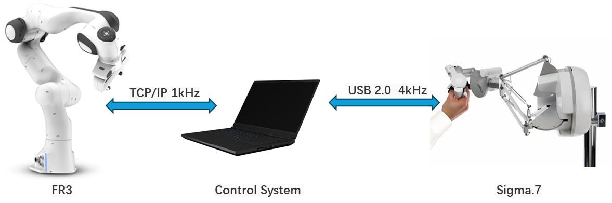

# Franka-Sigma.7-Teleoperation

ME5001 Project of NUS Mechanical Engineering

Franka Emikia Research 3 robotic arm teleoperation by Force Dimension Sigma.7




## Dependencies

* System Requirements:
  * Ubuntu 20.04
  * ROS Noetic
  * C++11 and above
  * CMake: 3.0.2 and above
* This repo depends on the following standard ROS pkgs:
  * `roscpp`
  * `rviz`
  * `actionlib`
  * `std_msgs`
  * `sensor_msgs`
  * `geometry_msgs`
  * `actionlib_msgs`
  * `tf2`
  * `tf2_ros`
  * `tf2_geometry_msgs`
  * `moveit_ros_planning_interface`
  * `franka_gripper`

## Prerequisites

  * ROS Noetic [ROS Installation](https://wiki.ros.org/noetic/Installation/Ubuntu)
  * MoveIt 1 Noetic [MoveIt Installation](https://moveit.github.io/moveit_tutorials/doc/getting_started/getting_started.html#install-ros-and-catkin/)
  * Franka Control Interface [FCI Installation](https://frankaemika.github.io/docs/installation_linux.html)

## Installation

This repo is a ros workspace, containing two rospkgs:

* `sigma7` contains the source code to run the Sigma.7 haptic device
* `franka` contains the source code and the launch file to control the Franka Emikia robotic arm

## Usage

### 1. Build Workspace

```bash
catkin_make
```

### 2. Turn on Sigma.7

```bash
# Super User
sudo su

# Source 
source devel/setup.bash

rosrun sigma7 sigma7
```

### 3. Control the Franka robotic arm

After **Step 2**, in the second terminal:

```bash
# Source 
source devel/setup.bash

roslaunch franka_execute franka_execute.launch
```


You should see the FR3 model on RViz.

### 4. Teleoperation

Now you can move Sigma.7 device to control the Franka robotic arm.
